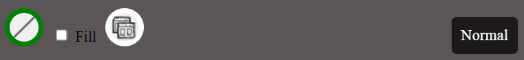

# Software Studio 2024 Spring
## Web Canvas

This is "2024 Spring CS241002 Software Studio" course project at National Tsing Hua University (NTHU)

### Scoring

| **Basic components**                             | **Score** | **Check** |
| :----------------------------------------------- | :-------: | :-------: |
| Basic control tools                              | 30%       | Y         |
| Text input                                       | 10%       | Y         |
| Cursor icon                                      | 10%       | Y         |
| Refresh button                                   | 5%       | Y         |

| **Advanced tools**                               | **Score** | **Check** |
| :----------------------------------------------- | :-------: | :-------: |
| Different brush shapes                           | 15%       | Y         |
| Un/Re-do button                                  | 10%       | Y         |
| Image tool                                       | 5%        | Y         |
| Download                                         | 5%        | Y         |

| **Other useful widgets**                         | **Score** | **Check** |
| :----------------------------------------------- | :-------: | :-------: |
| Line                                             | 1~5%      | Y         |
| Fill                                             | 1~5%      | Y         |
| Time And Location Display                        | 1~5%      | Y         |
| Style Change                                     | 1~5%      | Y         |

---

### How to use 
#### 整體示意圖如下

#### 功能列表介紹

    從第一列最左邊開始介紹是 Eraser,Brush,Text input,調整畫筆或是橡皮擦大小的slider,選取字型,
    最後是調節字體大小(可以透過輸入數字或是用點擊的方式改變大小)。

    第二列最左邊開始是 Refresh,Image upload,Download,Undo,Redo,Draw Circle,Draw Rectangle,Draw Triangle。
    後面三個是bonus function的部分。

    除了slider還有調節字型以及字體大小，其他按鍵都是透過點擊來使用其對應的功能。

    當前選取的作圖工具其border color是綠色，其他則是白色。
    (作圖工具:Eraser,Brush,Text input,Draw Circle,Draw Rectangle,Draw Triangle以及bonus function的Draw line)
    

    當滑鼠在調節字體大小的那一格的時候，就會在其那一格的右邊顯示兩個小按鍵，上面箭頭向上的按鍵點擊之後，就會將數字加一，下面則是減一。

    這裡是關於Brush(也會影響到Text input以及畫圖形(Circle Rectangle Triangle Line))顏色的調整。
    從左邊數過來1-5個鍵都是透過滑鼠直接點擊來改變Brush的顏色為其按鍵背景代表的顏色。分別是紅，藍，綠，黃，黑。
    至於第六個鍵比較不一樣，點擊之後會出現一個調色盤，可以透過改變RGB，或是直接在色域的部分透過滑鼠點擊來選擇想要的顏色。

    點擊之後在右邊的地方會先出現這個，

    在點擊這個新出現的模塊之後，會在模塊下方出現調色盤，如下顯示，

    當選好之後，假如是選如下圖的顏色，

    接下來只要按下enter鍵，或是直接在調色盤區域外的地方點擊，即可完成顏色的選取，並會將最右邊的按鍵其背景設為剛剛選擇的顏色。如下，

    並且第7個鍵跟1到5個鍵一樣，都是可以透過滑鼠直接點擊來達到改變畫筆顏色的效果。
    並且會將當前使用顏色的按鍵border color設為綠色，其他則是白色。

### Bonus Function description

    這裡是顯示當前時間以及經緯度的部分。

    這裡由左至右，分別是Draw line,Fill shape,Style change的部分。
    而最右邊的地方則是代表當前的Style，總共有三種，Normal，Crazy，Super Crazy。

    Draw line 的部分，就跟其他有作圖功能的按鍵一樣，都是透過點擊按鍵，來切換當前使用的工具。
    點擊之後，就變成是畫直線的畫筆，可以在canva上畫直線。
    其畫的顏色粗細都會跟Brush一樣，受到當前選擇的顏色還有調節畫筆大小的slider影響。

    Fill shape的部分，我是用checkbox來做的。預設是沒有要fill shape。
    當我們check之後，我們接下來畫的Circle Rectangle Triangle，都會變成實心的。

    Style change的部分，預設是Normal。當我們點擊之後，就會在Normal,Crazy,Super crazy這三個style依序切換。
    主要是改變canva外圍的背景顏色。

### Web page link

[https://hw1-canvas-d05c5.web.app/](https://hw1-canvas-d05c5.web.app/)

[https://hw1-canvas-d05c5.firebaseapp.com/](https://hw1-canvas-d05c5.firebaseapp.com/)

### Others (Optional)

    助教辛苦了

